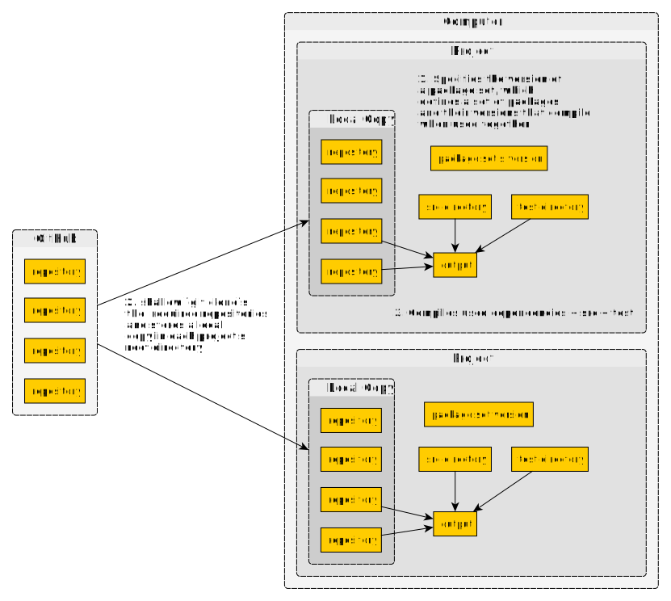

# Dependency Managers

## Why doesn't Purescript use `npm`?

The following provides a much shorter explanation of [this article](https://harry.garrood.me/blog/purescript-why-bower/)

Short answer:
- Because NPM doesn't produce a compiler error when multiple versions of the same transitive dependency are used.

Long answer:
- When package `foo` requires `bar v1.0.0` and package `baz` requires `bar v2.0.0`, NPM, will "nest" the packages, so that they will compile
- Should one or both packages export something that exposes `bar` and our code uses it, this will produce a runtime error, either because some API doesn't exist (e.g. one version changed/removed some API) or because a pattern match didn't work (e.g. an `instanceOf` check failed due to seeing different `data Bar` types)
- Bower (the 'official' version) uses "flat" dependencies, so we get the compile error when this situation arises. How? It'll ask you what you want to do to resolve the issues. Rather than decide one over the other, you pull out and rethink through your dependencies.

However, `bower` isn't the only package manager one can use. `psc-package` is also used throughout the community.

## Which dependency manager should I use: Bower or PSC-Package?

One can refer to each with a "crude name" that summarizes them:
- Typical package manager (Bower)
- Glorified `git clone` tool (psc-package)

Those names, plus these flowcharts, will help one get an overview of how they work:

### Bower Flowchart

### Psc-Package Flowchart 

Now for a side-by-side comparison (an "apples to oranges" comparison)

| | Bower | Psc-Package |
| - | - | - |
| Design Goals | ? | [See this summary](https://github.com/purescript/psc-package#design-goals)
| Official/Unofficial | Official parts of `purs` depend on it | Unofficial
| Trajectory | Moving away | Moving towards
| Pros | <ul><li>**Bower is required for one to publish docs to [Pursuit](https://pursuit.purescript.org/)**</li><li>Bower caches its dependencies, so you can download a version of a package only once and use it everywhere on your system</li><li>It's the "official" dependency manager for Purescript</li></ul> | <ul><li>**Defines a set of versions of specific packages that are proven via CI to work together**</li><li>Uses Git to work, which is usually already installed on all systems</li><li>Reliably produces reproducible Purescript dependencies</li><li>Reduces verbosity somewhat by omitting the `purescript-` prefix on PureScript packages</li></ul>
| Cons | <ul><li>**Figuring out which version of a package works with another version of a package is needlessly time-consuming**</li><li>Uses node to work, which may not be installed on all systems</li><li>Doesn't always produce reproducible dependencies due to its caching feature.</li></ul> | <ul><li>If developing a library, one cannot publish docs to Pursuit without Bower. (For end-user apps, this doesn't matter.)</li><li>Uses more memory due to duplicating code when one has multiple projects across their system.</li><li>Not the "official" package manager (but who really determines what is 'official' anyway?)</li><li>If the standard package set does not have some package in it, one must maintain their own copy. (However, [Spachetti](https://github.com/justinwoo/spacchetti) makes it easier to deal with this. [Read its guide](https://spacchetti.readthedocs.io/en/latest/))</li></ul>

## The `Batteries` Prelude

The closest idea Bower has to a `package set` is the [`batteries` prelude](https://github.com/tfausak/purescript-batteries) that is no longer maintained and doesn't work for PureScript 0.12.0. I looked through it a month ago and updated the dependencies in their `bower.json` file to [this file](updated-batteries.json), which enables one to use the [Halogen](https://github.com/slamdata/purescript-halogen) library, v4.0.0. (Note: this file is not a correctly-formatted Bower.json file). I abandoned it after I learned about psc-package, but I'm including it here in case others want to use Bower and find a use for it.
