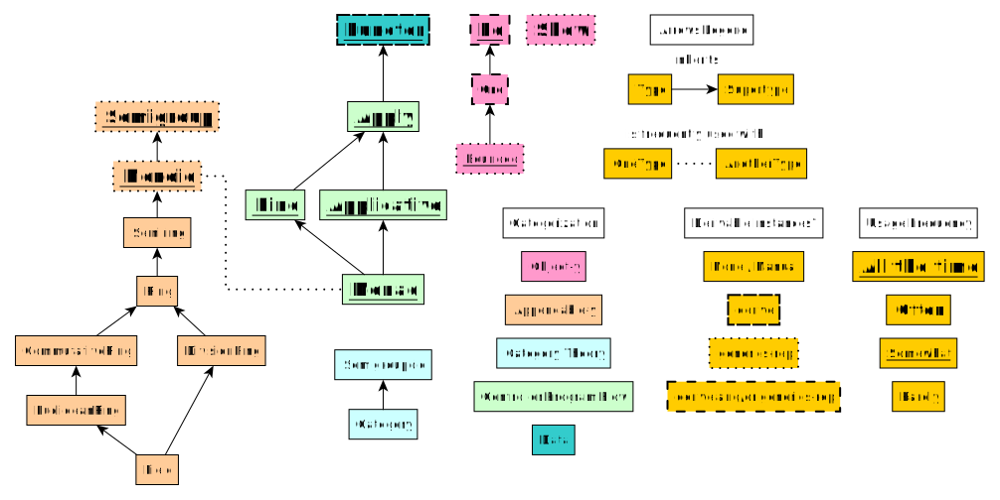

# General Overview of Type Classes

Type classes are usually an encapsulation of 1-3 things:

1. (Usually) The definition of type signatures for a single/multiple functions/values.
    - Functions may be put into infix notation using aliases to make it easier to write them.
2. (Usually) The laws by which implementations of a type class must abide.
    - These laws guarantee certain properties, increasing developers' confidence that their code works as expected.
    - They also help one to know how to refactor code. Given `left-hand-side == right-hand-side`, evaluating code on the left may be more expensive (memory, time, IO, etc.) than the code on the right.
3. (Usually) The functions/values that can be derived once one implements the type class.
    - Most of the power/flexibility of type classes come from the combination of the main functions/values implemented in a type class' definition and these derived functions. When a type class extends another, the type class' power increases, its flexibility decreases, and its costs increase.
        - For example, `Apply` is a less powerful typeclass than Monad because it does not have `bind` but is more flexible than Monad because it can compute things in parallel.

Here are some examples:
- The `Show` typeclass specifies a type signature for a function called `show`, but implementations don't have any laws for it, nor are there any derived functions.
- The `Eq` type class specifies a type signature for a function called `eq` and `notEq`, and laws for the two, but there are not any derived functions.
- The `Ord` type class is similar to `Eq`, but it does have derived functions.

Lastly, the `Functor` type class has all three:

(1) The type class `Functor` specifies the type signature of a function called `map`. It does not specify a type signature for a value:
```purescript
class Functor f where
  map :: forall a b. (a -> b) -> f a -> f b
```
and it uses the alias `<$>` for `map` to enable one to write `function <$> f_a` instead of `map function f_a`

(2) It also specifies the laws to which a correct implementation will adhere when implementing `map`:
- identity: `map id fa == fa` where `id` is `(\x -> x)`. In other words, if the function returns what it is given, then I should get back the same data structure that I put into `map`.
- composition: `map (function2 <<< function1) fa == (map function2) <<< (map function1 fa)` where `f <<< g a` is `f(g(a))`. In other words, rather than unwrapping and rewrapping the value stored in a Functor (e.g. Box) twice, I can unwrap it only once.

(3) Once `map` has been implemented correctly, Functor provides the following derived functions:
- void
- voidRight
- voidLeft
- mapFlipped
- flap

## Tricks for Implementing a Type Class Instance

Keep in mind that when implementing a type class, one does not always need to implement its function with a specific implementation for a given type. There are two situations in which this can occur:

First, this situation can arise when a type class defines two or more functions. Sometimes, a function in a type class can be defined using another function from that same type class. Take, for example, the `Eq` type class:
```purescript
class Eq a where
  eq :: a -> a -> Boolean

  notEq :: a -> a -> Boolean
```
Granted, an `Eq` instance can be derived by the compiler. However, assuming this wasn't the case, there are two ways we could implement it:
1. We could implement only `eq` and implement `notEq` by inverting `eq`'s result.
2. We could implement only `notEq` and implement `eq` by inverting `notEq`'s result

Second, sometimes, a function in a type class can be defined using a function from a super type class. Take, for example, the `Ord` type class:
```purescript
data Ordering
  = LT
  | EQ
  | GT

class (Eq a) <= Ord a where
  compare :: a -> a -> Ordering
```
If we implement `compare`, we can also implement `eq`:
```purescript
data ColoredBox
  = RedBox
  | GreenBox

instance ordColoredBox :: Ord ColoredBox where
  compare RedBox GreenBox = LT
  compare GreenBox RedBox = GT
  compare _ _ = EQ {- which expands to...
  compare RedBox RedBox = EQ
  compare GreenBox GreenBox = EQ
  -}

instance eqColoredBox :: Eq ColoredBox where
  eq a b = (compare a b) == EQ

  notEq a b = (compare a b) /= EQ
```

## Prelude - Type Class Relationships

Below is a dependency graph / type class categorization of the type classes found in Prelude. The usage frequency key is my current understanding and may be inaccurate for the "somewhat"/"rare" type classes:

