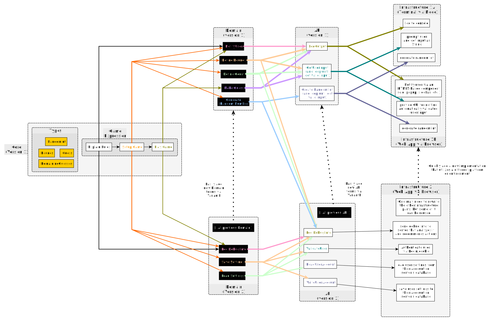

# Random Number

This folder will show how to build a random number game using the Onion Architecture idea. There are four folders:
- Shared Code: the main types, data structures, and their related functions that is used across all the other folders
- Free: the program written using `Free`. Thus, it cannot be changed/improved easily
- Run: the program written using `Run`. Once the `Run` boilerplate code is written, we'll show that how easy it is to change/improve the code.
    - Version 1: the base version that looks just like the `Free` counterpart
- (not yet started...) MTL: the program written using `MTL`-style of code.

## Control Flow

The following image is the general flow of the program:

## Overview of the Architecture

### Core

We'll first define the terms we'll be using throughout our program. When I thought about this 'domain', I came up with these concepts:

| Name | What it is | Usage/Rules | Implementation
| - | - | - | - |
| Bounds | The lower and upper int boundaries | <ul><li>The lower value should ALWAYS be less than the upper value</li><li>The lower value should never be equal to the upper value</li><li>Used to insure the generated random Int and a player guess is within its bounds</li></ul> | A newtyped `Record` that exports only its smart constructor to insure correct instantiation. Helper functions also exist in the module, some of which are exported.
| RandomInt | The random int the player is trying to guess | <ul><li>It should be within `Bounds`: `lower <= x <= upper`</li><li>Once created, the value is read-only</li></ul> | A newtyped `Int` that exports only its smart constructor to insure correct instantiation and usage.
| Guess | The guess the player makes | <ul><li>It should be within `Bounds`: `lower <= x <= upper`</li><li>It can only be compared with the `RandomInt` to determine whether they are equal</li></ul> | A newtyped `Int` that exports only its smart constructor to insure correct instantiation. `guessEqualsRandomInt` function is also exported and usable via `==#` infix notation.
| RemainingGuesses | The remaining guesses the player has | <ul><li>The initial value should be positive</li><li>The value can only decrease by one</li></ul> | A newtyped `Int` that exports only its smart constructor to insure correct instantiation. `decrement` function correctly reduces the wrapped `Int` by one and `outOfGuesses` checks whether the player can keep playing

A game consists of four stages:
1. explaining the rules
2. setting up the game
3. playing it
4. ~ending it~ (this was removed so that I could test the game via QuickCheck (still a WIP))

I defined this as my language, wrote their smart constructors and then wrote the basic program, `game`.

To make it easier to work with the types, I also added
- `GameInfo` which groups two things together with a clearer name than `Tuple` and
- `GameResult` which defines the two possible outcomes of our game (player wins/loses).

### Domain

I wrote non-compiling code (i.e. `runCore`) that "translated" the Core language into a yet-to-be-defined language that I would use for my Domain. At this level, I focused on breaking the larger concepts down into smaller ones.

Once I understood what I needed, I wrote a language data type and its smart constructors to make my translation compile.

### API

I wrote non-compiling code (i.e. `runDomain`) that translated the Domain language into a yet-to-be-defined language that I would use for my API. At this level, I created instances of my types and handled any errors that arose.

My goal was to make a smooth interface between the Domain level and the Infrastructure level. Why? Because the Infrastructure level will eventually be a test suite that uses mocking to get there. If I handle errors at the Infrastructure level, my test code won't test the program since it will need to create its own copy of that error-handling code, which may change in the future and quickly become outdated.

### Infrastructure

This was the easy part. I "translated" the API language into impure code (via `Effect`/`Aff`).

Rather than writing a new file called `Main.purs` that ran the infrastructure, I just inlined the `main` function at the bottom of `Infrastructure.purs`.

### Miscellaneous Comments

Due to `gameLoop` in `Domain` and `recursivelyRunUntilPure` in `API`, this code has the possibility of blowing the stack. However, since it is interpreted into the `Aff` monad, which is stack-safe, I did not need to worry about this possibility.

The actual code demonstrated here only implements the Node infrastructure for the first version of the API (see next section). However, one could quickly build a browser version using Halogen or a similar library.

## Onion Architecture

The following image is a rewritten version of the above flow using the onion architecture. To read it, keep the following ideas in mind:
- The arrows indicate how one level's language is "interpreted"/"tranlsated" into another level's language via a natural transformation
- Version 2 of the Domain and API and Infrastructure levels **are not implemented** in this folder. However, they could be fairly easily, and that's the point of using the Onion Architecture.

Here's the image

